<div align="center">


<br>


&nbsp;&nbsp;
[](https://github.com/sweetvn04)

<br><br>

<!-- LIVE TERMINAL PROMPT (TYPING ANIMATION) -->
[](https://git.io/typing-svg)

<br>

<!-- PLAYER STATUS HUD -->


<br><br>

<!-- ACTIVE QUESTS -->


<br><br>

<!-- EQUIPPED LOADOUT -->


<br><br>

<!-- SKILLS / WEAPON INVENTORY -->
<h3>🎒 WEAPON INVENTORY // TECH STACK 🎒</h3>


<br><br>


<!-- MINI-GAME SNAKE -->
<h3>👾 MINI-GAME: CONTRIBUTION SNAKE 👾</h3>

<picture>
  <source media="(prefers-color-scheme: dark)" srcset="https://raw.githubusercontent.com/sweetvn04/sweetvn04/output/github-contribution-grid-snake-dark.svg" />
  <source media="(prefers-color-scheme: light)" srcset="https://raw.githubusercontent.com/sweetvn04/sweetvn04/output/github-contribution-grid-snake.svg" />
  
</picture>

<br><br>

<!-- ARCADE LEADERBOARD -->
<h3>📊 ARCADE LEADERBOARD // STATS 📊</h3>


<br><br>


<br><br>

[](https://github.com/sweetvn04)

<br><br>


<!-- MULTIPLAYER / CONNECT -->
<h3>🌐 MULTIPLAYER LOBBY // CO-OP 🌐</h3>

<br>

[](mailto:3flowers2004@gmail.com)
&nbsp;&nbsp;
[](https://github.com/sweetvn04)
&nbsp;&nbsp;
[](https://sweetvn2004.id.vn)

<br><br>

<!-- TERMINAL FOOTER WITH TYPING CURSOR -->
```text
┌──(sweetvn㉿arch)-[~]
└─$ exit
[Process completed - 0 errors, ready for next quest]
```


</div>
